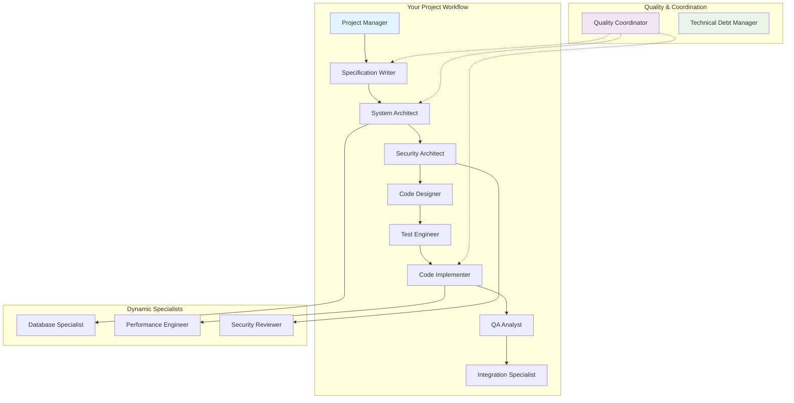

# 🚀 Advanced Roo Code Framework for Complex Development Projects

[](https://github.com) [](https://semver.org/) [](LICENSE) [](https://docs.anthropic.com)

**A sophisticated Roo Code configuration framework that organizes complex development workflows through specialized AI modes, structured handoffs, and quality assurance patterns.**

---

## 📋 Table of Contents

- [🎯 What This Actually Does](#-what-this-actually-does)
- [✅ What You Get](#-what-you-get)
- [⚠️ What This Requires](#️-what-this-requires)
- [🏗️ Framework Architecture](#️-framework-architecture)
- [⚡ Quick Start](#-quick-start)
- [🛠️ Installation](#️-installation)
- [📖 Usage Guide](#-usage-guide)
- [📁 Project Structure](#-project-structure)
- [🔧 Configuration](#-configuration)
- [📚 Examples](#-examples)

## 🎯 What This Actually Does

This framework provides **advanced Roo Code configurations** that transform how you manage complex development projects through AI assistance. Instead of using a single generic AI chat, you work with **specialized AI modes** that understand different aspects of development.

### **Real Benefits You'll Get:**
- **🎭 Specialized AI Personalities**: 15+ pre-configured modes for architecture, security, testing, implementation, etc.
- **📋 Structured Workflows**: Organized handoffs between different types of work instead of chaotic back-and-forth
- **🔍 Quality Assurance**: Built-in patterns for maintaining consistency across AI-generated outputs
- **📊 Progress Tracking**: Clear visibility into project status and decision history
- **🔒 Security-First**: Granular permissions and access controls for different AI operations
- **🚀 Productivity Gains**: Faster iteration through purpose-built AI interactions

### **What This Is NOT:**
- ❌ **Not Fully Autonomous**: Requires substantial human oversight and decision-making
- ❌ **Not Plug-and-Play**: Needs significant customization for your specific projects
- ❌ **Not AI Magic**: Still fundamentally limited by what Roo Code and LLMs can actually do
- ❌ **Not One-Size-Fits-All**: You'll need to adapt modes and workflows to your context

## ✅ What You Get

### **Advanced Mode Definitions**
Pre-built specialized AI modes with:
- **Role-specific expertise**: Security architect, performance engineer, test specialist, etc.
- **Intelligent task delegation**: Modes that know when to hand off work to other specialists
- **Quality gates**: Built-in criteria for evaluating completeness before handoffs
- **Context awareness**: Understanding of how their work fits into larger workflows

### **Structured Project Organization**
- **State Management**: JSON schemas for tracking workflow progress and decisions
- **Handoff Contracts**: Formal templates for passing work between AI modes
- **Memory Systems**: Persistent context that maintains project knowledge across sessions
- **Progress Tracking**: Clear visibility into what's been done and what's next

### **Quality Assurance Framework**
- **Consistency Checking**: Patterns for ensuring AI outputs align across modes
- **Quality Metrics**: Measurable criteria for evaluating work quality
- **Review Processes**: Structured approaches for validating AI-generated work
- **Improvement Tracking**: Learn from successful patterns and avoid repeated issues

### **Integration Patterns**
- **MCP Server Integration**: Connect external services for research, fact-checking, web browsing
- **API Provider Flexibility**: Work with Claude, GPT-4, local models, or enterprise providers
- **Custom Commands**: Automate frequently-used prompts and workflows
- **Team Collaboration**: Share configurations and maintain consistency across team members

## ⚠️ What This Requires

### **From You:**
- **Roo Code Expertise**: This is for advanced users who understand Roo Code's capabilities and limitations
- **Project Management**: You'll still need to plan, prioritize, and make strategic decisions
- **Quality Oversight**: AI outputs require human validation and refinement
- **Customization Work**: Expect to spend time adapting modes and workflows to your needs

### **Technical Requirements:**
- **VS Code** with Roo Code extension v3.25+
- **API Access** to AI providers (Claude, OpenAI, etc.)
- **Node.js 18+** for validation scripts (optional)
- **Understanding of YAML/JSON** for configuration

### **Time Investment:**
- **Initial Setup**: 4-8 hours to configure and customize for your first project
- **Learning Curve**: 1-2 weeks to become proficient with the workflow patterns
- **Ongoing Maintenance**: Regular updates to modes and quality criteria as you learn what works

## 🏗️ Framework Architecture

### **Specialized AI Modes Working Together**



### **How It Actually Works**

1. **You Start**: Choose appropriate mode for your current task
2. **AI Executes**: Mode performs specialized work within its expertise
3. **Quality Check**: Built-in criteria evaluate completeness and quality
4. **Smart Handoffs**: Mode identifies what needs to happen next and creates appropriate tasks
5. **You Coordinate**: Review outputs, make decisions, and guide overall direction
6. **Continuous Improvement**: System learns from successful patterns

## ⚡ Quick Start

### **Prerequisites**
- VS Code with Roo Code extension installed and configured
- At least one AI provider (Claude recommended)
- Basic familiarity with Roo Code custom modes

### **30-Second Demo**

```bash
# 1. Clone the repository
git clone [repository-url]
cd roo-advanced-framework

# 2. Open in VS Code
code .

# 3. Copy the .roomodes file to activate custom modes
# VS Code will detect the new modes automatically

# 4. Try a simple workflow
# - Switch to "Specification Writer" mode
# - Ask: "Create a specification for a user authentication system"
# - Watch it create tasks for security architect and system architect
```

**You'll immediately see**:
- Multiple specialized modes available in Roo Code's mode selector
- AI that understands its role and creates appropriate follow-up tasks
- Structured approach to breaking down complex work
- Clear handoff points between different types of expertise

## 🛠️ Installation

### **Step 1: Basic Setup**

```bash
# Clone and enter directory
git clone [repository-url]
cd roo-advanced-framework

# Install validation tools (optional)
npm install -g ajv-cli yaml-js

# Validate configuration
./scripts/validate.sh
```

### **Step 2: VS Code Integration**

1. **Ensure Roo Code Extension**: Latest version installed and configured
2. **Open Project Folder**: The `.roomodes` file will be automatically detected
3. **Configure Auto-Approval**: Enable appropriate auto-approval settings in Roo Code UI
4. **Test Mode Switching**: Try switching between different modes in the mode selector

### **Step 3: Customize for Your Project**

```bash
# Update project identity
mv project/sample-app project/your-project-name

# Edit core context files
code memory-bank/productContext.md    # Your project's business context
code memory-bank/systemPatterns.md   # Your coding standards
code project/your-project-name/control/backlog.yaml  # Your project backlog
```

### **Step 4: Optional Enhancements**

**MCP Servers** (for enhanced research capabilities):
- Configure Exa for web search
- Set up Perplexity for fact-checking
- Add Context7 for technical documentation access

**See `docs/mcp/config.sample.md` for detailed MCP setup instructions.**

## 📖 Usage Guide

### **Starting Your First Workflow**

**1. Define Your Project Context**
```markdown
# Edit memory-bank/productContext.md
## Vision
Building a SaaS application for small business inventory management

## Goals
- MVP launch within 3 months
- Support 100 concurrent users
- Simple, intuitive interface
- Robust data security
```

**2. Begin with Specification Writer**
```
Switch to: "📋 Specification Writer" mode
Prompt: "Create a detailed specification for user authentication and authorization, 
considering small business users who aren't technically sophisticated."
```

**3. Watch the Workflow Unfold**
- Specification Writer will create requirements and acceptance criteria
- It will automatically create tasks for Security Architect to review auth patterns
- Security Architect will create tasks for System Architect to integrate security
- Each mode builds on previous work while maintaining quality standards

**4. Your Role: Guide and Decide**
- Review each mode's output for business alignment
- Make strategic decisions when modes identify trade-offs
- Provide domain expertise that AI modes don't have
- Coordinate timeline and resource priorities

### **Advanced Workflow Patterns**

**Quality-First Development:**
```yaml
# Typical flow for a new feature
1. Specification Writer → defines requirements
2. System Architect → designs solution
3. Security Architect → validates security approach  
4. TDD Engineer → creates test specifications
5. Code Implementer → builds feature
6. QA Analyst → validates against requirements
7. Integration Specialist → ensures system coherence
```

**Issue-Driven Development:**
```yaml
# When problems are discovered mid-development
1. Quality Coordinator → detects inconsistencies
2. Creates targeted tasks for appropriate specialists
3. Specialists collaborate to resolve issues
4. Quality gates prevent progression until resolved
```

## 📁 Project Structure

```
roo-advanced-framework/
├── 📄 README.md                     # This documentation
├── 🎭 .roomodes                     # Custom mode definitions (15+ specialized AI personalities)
├── 🧠 memory-bank/                  # Persistent project knowledge
│   ├── productContext.md           # Business context and goals
│   ├── decisionLog.md              # Important decisions and rationale
│   ├── systemPatterns.md           # Coding standards and conventions
│   └── progress.md                 # Current status and next steps
├── 📁 project/sample-app/          # Project-specific files (rename for your project)
│   └── control/                    # Workflow coordination files
│       ├── graph.yaml              # Workflow definition
│       ├── state.json              # Current workflow status
│       ├── backlog.yaml            # Project backlog
│       └── sprint.yaml             # Current sprint plan
├── 📚 docs/                        # Documentation and schemas
│   ├── contracts/                  # JSON schemas for validation
│   └── mcp/                        # MCP server setup guides
└── 🔧 scripts/                     # Automation and validation
    └── validate.sh                 # Validate all configurations
```

### **Key File Purposes**

| File | Purpose | When to Modify |
|------|---------|----------------|
| `.roomodes` | **AI mode definitions** | Customize for your domain expertise needs |
| `memory-bank/productContext.md` | **Project business context** | Update with your project goals and constraints |
| `project/*/control/graph.yaml` | **Workflow sequence** | Modify for your development process |
| `project/*/control/backlog.yaml` | **Project features and tasks** | Regular updates as project evolves |

## 🔧 Configuration

### **Basic Mode Customization**

**Create a Custom Mode for Your Domain:**
```yaml
# Add to .roomodes
customModes:
  - slug: fintech-specialist
    name: 🏦 FinTech Specialist
    description: Expert in financial services compliance and security
    roleDefinition: |
      You are a financial technology specialist with deep expertise in:
      - PCI DSS compliance and payment security
      - Financial regulations (SOX, GDPR, PSD2)
      - Fraud detection and risk management
      - Banking API integrations and standards
    customInstructions: |
      Always consider:
      - Regulatory compliance implications
      - Data privacy requirements
      - Audit trail necessities
      - Financial risk assessments
    groups:
      - read
      - edit
      - browser
```

### **Project Context Setup**

**Define Your Development Standards:**
```markdown
# memory-bank/systemPatterns.md
# Development Standards

## Code Quality
- Functions should be under 50 lines
- Test coverage must exceed 90%
- All public APIs require documentation
- Security review required for authentication code

## Architecture Principles  
- Microservices with clear boundaries
- Event-driven communication between services
- Database per service pattern
- Infrastructure as code for all deployments
```

### **Quality Gates Configuration**

**Set Project-Specific Quality Criteria:**
```json
// project/your-project/control/quality-criteria.json
{
  "code_quality": {
    "min_test_coverage": 0.90,
    "max_function_complexity": 10,
    "security_scan_required": true
  },
  "architecture": {
    "max_service_dependencies": 5,
    "documentation_completeness": 0.85,
    "performance_benchmarks_required": true
  }
}
```

## 📚 Examples

### **Example 1: E-commerce Platform**

**Initial Setup:**
```yaml
# project/ecommerce-platform/control/backlog.yaml
epics:
  - id: E-001
    name: User Management
    stories:
      - id: US-001
        title: As a customer, I can create an account with email verification
        priority: High
        acceptance: ["email verification", "password strength", "GDPR compliance"]
      
  - id: E-002  
    name: Product Catalog
    stories:
      - id: US-002
        title: As a customer, I can browse products with filters and search
        priority: High
        acceptance: ["search performance", "filter accuracy", "mobile responsive"]
```

**Workflow Example:**
1. **Specification Writer** creates detailed requirements for user registration
2. **Security Architect** identifies GDPR compliance needs and creates privacy specialist task
3. **System Architect** designs user service architecture
4. **Database Specialist** optimizes user data schema for performance
5. **TDD Engineer** creates comprehensive test suite
6. **Code Implementer** builds the feature
7. **QA Analyst** validates against acceptance criteria

### **Example 2: Data Analytics Platform**

**Custom Mode for Domain:**
```yaml
- slug: data-engineer
  name: 📊 Data Engineer
  description: Specialist in data pipelines, ETL, and analytics architecture
  roleDefinition: |
    Expert in building scalable data processing systems with focus on:
    - ETL pipeline design and optimization
    - Data warehouse and lake architectures  
    - Stream processing and real-time analytics
    - Data quality and governance frameworks
  groups: [read, edit, command, browser]
```

**Quality Criteria:**
```yaml
data_quality_gates:
  - "data_lineage_documented"
  - "pipeline_performance_benchmarked" 
  - "data_validation_rules_implemented"
  - "monitoring_alerts_configured"
```

### **Example 3: Mobile App Development**

**Mobile-Specific Modes:**
```yaml
customModes:
  - slug: mobile-architect
    name: 📱 Mobile Architect
    description: Expert in mobile app architecture and platform-specific concerns
    roleDefinition: |
      Mobile development specialist focusing on:
      - Cross-platform vs native architecture decisions
      - Mobile-specific security patterns
      - Performance optimization for mobile devices
      - App store compliance and deployment
    
  - slug: ux-mobile-specialist
    name: 🎨 Mobile UX Specialist  
    description: User experience expert for mobile interfaces
    roleDefinition: |
      Mobile UX specialist with expertise in:
      - Mobile-first design patterns
      - Touch interface optimization
      - Mobile accessibility standards
      - Platform-specific design guidelines (iOS HIG, Material Design)
```

## 🚀 Getting the Most Value

### **Best Practices for Success**

**Start Small and Build:**
- Begin with 2-3 modes that match your most common work
- Add complexity gradually as you understand the patterns
- Customize mode definitions for your specific domain

**Maintain Quality Standards:**
- Review all AI outputs before accepting
- Use quality gates to catch issues early  
- Update patterns based on what works and what doesn't

**Learn and Adapt:**
- Pay attention to which mode combinations work best
- Document successful patterns in your memory bank
- Share effective configurations with your team

### **Common Pitfalls to Avoid**

❌ **Over-Engineering**: Don't create modes for every possible specialty
❌ **Under-Customization**: Generic modes won't match your specific needs  
❌ **Quality Shortcuts**: Skipping validation leads to accumulated technical debt
❌ **Context Loss**: Not maintaining project memory leads to repeated work

## 📈 Expected Outcomes

### **Immediate Benefits (First Week)**
- **Organized Workflows**: Clear structure instead of chaotic AI conversations
- **Domain Expertise**: AI responses tailored to specific types of work
- **Quality Consistency**: Built-in criteria prevent low-quality outputs
- **Progress Visibility**: Clear understanding of project status

### **Medium-Term Benefits (First Month)**  
- **Productivity Gains**: Faster iteration through purpose-built interactions
- **Reduced Rework**: Quality gates catch issues before they compound
- **Better Planning**: Structured approach reveals dependencies and risks
- **Knowledge Retention**: Project memory prevents repeated explanations

### **Long-Term Benefits (Ongoing)**
- **Team Coordination**: Shared configurations ensure consistency across team members  
- **Continuous Improvement**: Learning from successful patterns improves future projects
- **Scalable Processes**: Framework adapts to larger and more complex projects
- **Expertise Development**: Working with specialized AI modes builds your own domain knowledge

## 🤝 Contributing & Community

### **Ways to Contribute**
- **Share Successful Modes**: Contribute domain-specific mode definitions
- **Document Patterns**: Share workflow patterns that work well for your projects
- **Report Issues**: Help identify problems with configurations or documentation
- **Improve Examples**: Add real-world examples from different domains

### **Community Resources**
- **GitHub Discussions**: Share experiences and get help from other users
- **Example Gallery**: Browse mode definitions and workflow patterns from the community
- **Best Practices Wiki**: Collaborative documentation of proven approaches

---

## 📄 License

This project is licensed under the MIT License - see the [LICENSE](LICENSE) file for details.

## 🙏 Acknowledgments

- **Anthropic** for Roo Code and Claude AI technology
- **Roo Code Community** for sharing patterns, modes, and best practices  
- **Early Adopters** who provided feedback and real-world validation
- **Contributors** who shared domain expertise and workflow improvements

---

<div align="center">

**Ready to supercharge your Roo Code workflows?**

[Get Started](#-quick-start) • [View Examples](#-examples) • [Join Community](https://github.com/discussions)

*Framework for advanced users who want structured, high-quality AI-assisted development*

**⭐ Star this repository if it improves your development workflow!**

</div>

---

*Documentation Version: 1.0.0 | Framework Version: 1.0.0 | For Roo Code v3.25+*