# 🧠 Roo Advanced Autonomous AI Development Framework

[](https://opensource.org/licenses/MIT)
[](https://marketplace.visualstudio.com/items?itemName=roo-code)
[](https://www.python.org/downloads/)
[](https://nodejs.org/)
[]()

> **Revolutionary autonomous AI development system with 15+ specialized AI agents working collaboratively to deliver enterprise-grade software with minimal human intervention.**

## 🚀 Quick Start

**TL;DR**: An intelligent development system where AI specialists collaborate autonomously to build software, manage quality, resolve conflicts, and learn from every project.

### **Key Differentiators**
- **99% Autonomous Operation**: AI agents handle requirement analysis, architecture, coding, testing, and quality assurance
- **Intelligent Conflict Resolution**: Evidence-based technical decision making between AI specialists  
- **Continuous Learning**: Pattern recognition that improves performance across projects
- **Quality-First Approach**: Built-in quality gates and monitoring with automatic intervention
- **Enterprise Security**: Security-by-design with dedicated security architecture specialists

---

## 📋 Table of Contents

1. [Architecture Overview](#-architecture-overview)
2. [AI Agent Ecosystem](#-ai-agent-ecosystem)
3. [Installation](#-installation)
4. [Quick Start Guide](#-quick-start-guide)
5. [Project Structure](#-project-structure)
6. [Configuration](#-configuration)
7. [Workflow Examples](#-workflow-examples)
8. [Quality Assurance](#-quality-assurance)
9. [Troubleshooting](#-troubleshooting)
10. [Contributing](#-contributing)

---

## 🏗️ Architecture Overview

The Roo Framework orchestrates specialized AI agents through an intelligent control plane that manages workflows, quality gates, and autonomous decision-making.

### **High-Level System Architecture**

```mermaid
graph TB
    subgraph "Human Interface Layer"
        VSCode[VS Code + Roo Extension]
        WebUI[Web Interface]
    end
    
    subgraph "Orchestration Layer"
        Orchestrator[🧠 SPARC Orchestrator]
        QACoord[📊 Quality Assurance Coordinator]
        TechDebt[🔧 Technical Debt Manager]
    end
    
    subgraph "Specialist Agents"
        SpecWriter[📋 Specification Writer]
        Architect[🏗️ System Architect]
        Security[🛡️ Security Architect]
        TDD[🧪 TDD Engineer]
        CodeImpl[💻 Code Implementer]
        Integration[🔌 Integration Specialist]
    end
    
    subgraph "Intelligence Layer"
        MemoryBank[(🧠 Memory Bank)]
        Patterns[(📊 Learning Patterns)]
        QualityGates[(✅ Quality Gates)]
    end
    
    subgraph "External Services"
        MCP[MCP Servers]
        APIs[External APIs]
        Repos[Code Repositories]
    end
    
    VSCode --> Orchestrator
    Orchestrator --> SpecWriter
    Orchestrator --> Architect
    Orchestrator --> Security
    Orchestrator --> QACoord
    
    SpecWriter --> TDD
    Architect --> CodeImpl
    Security --> Integration
    
    QACoord --> MemoryBank
    TechDebt --> Patterns
    
    Orchestrator --> MCP
    Integration --> APIs
    CodeImpl --> Repos
    
    MemoryBank --> QualityGates
    Patterns --> QualityGates
```



### **Autonomous Workflow Engine**


### **Learning and Quality Management**


---

## 🤖 AI Agent Ecosystem

### **Core Orchestration Agents**

| Agent | Role | Key Capabilities | Auto-Triggers |
|-------|------|------------------|---------------|
| **🧠 SPARC Orchestrator** | System Coordinator | Strategic oversight, conflict resolution, resource coordination | Quality crises, technical conflicts, workflow deadlocks |
| **📊 Quality Assurance Coordinator** | Quality Guardian | Cross-mode consistency, quality intervention, continuous monitoring | Quality regressions, inconsistency detection |
| **🔧 Technical Debt Manager** | Debt Prevention | Proactive debt detection, refactoring prioritization, maintenance planning | Code quality thresholds, complexity alerts |

### **Domain Specialists**

#### **Requirements & Design**
- **📋 Specification Writer**: Requirements analysis, user story creation, acceptance criteria
- **🏗️ System Architect**: Solution design, technology selection, architectural decisions
- **🎨 UI/UX Designer**: User interface design, experience optimization, accessibility

#### **Security & Compliance** 
- **🛡️ Security Architect**: Threat modeling, security controls, vulnerability assessment
- **👤 Privacy Specialist**: Data protection, regulatory compliance, privacy by design
- **📋 Compliance Reviewer**: Standards adherence, audit preparation, regulatory alignment

#### **Implementation & Testing**
- **🧪 TDD Engineer**: Test strategy, test automation, quality validation
- **💻 Code Implementer**: Feature development, code generation, implementation patterns
- **🔌 Integration Specialist**: System integration, API coordination, service orchestration

#### **Quality & Performance**
- **⚡ Performance Engineer**: Performance optimization, scalability planning, monitoring
- **🗃️ Database Specialist**: Data modeling, query optimization, database architecture
- **♿ Accessibility Specialist**: WCAG compliance, inclusive design, accessibility testing

### **Specialized Intelligence**


---

## ⚙️ Installation

### **Prerequisites**

- **VS Code** with Roo Code extension v3.25+
- **Python 3.8+** for validation scripts
- **Node.js 18+** for MCP server integration
- **Git** for version control
- **API Access** to AI providers (Claude, OpenAI, etc.)

### **System Requirements**

| Component | Minimum | Recommended |
|-----------|---------|-------------|
| RAM | 8GB | 16GB+ |
| Storage | 2GB free space | 5GB+ SSD |
| CPU | 4 cores | 8+ cores |
| Network | Stable internet | High-speed connection |

### **Step 1: Clone and Setup**

```bash
# Clone the framework
git clone https://github.com/your-org/roo-advanced-framework.git
cd roo-advanced-framework

# Install Python dependencies
pip install -r requirements.txt

# Install Node.js dependencies (for MCP servers)
npm install

# Make setup script executable
chmod +x scripts/setup_project.sh
```

### **Step 2: Configure Roo Code Extension**

1. **Install Extension**: VS Code Extensions → Search "Roo Code" → Install v3.25+
2. **Configure Auto-Approval**: Enable autonomous task delegation in Roo Code settings
3. **Set API Keys**: Configure your AI provider credentials in Roo Code
4. **Test Connection**: Verify AI provider connectivity

### **Step 3: Initialize Your First Project**

```bash
# Run the interactive setup
./scripts/setup_project.sh

# Follow prompts to:
# - Name your project (e.g., "my-saas-app")
# - Choose project type (web app, mobile, API, etc.)
# - Set initial quality standards
# - Configure team size and timeline
```

### **Step 4: Validate Configuration**

```bash
# Validate all configurations
python scripts/validate_config.py your-project-name

# Should output: ✅ All configurations valid
```

---

## 🚀 Quick Start Guide

### **Your First Autonomous Development Session**

#### **1. Define Project Context**

```bash
# Edit your project's context
code memory-bank/productContext.md
```

```markdown
# Product Context - My SaaS App

## Vision
Building a customer relationship management system for small businesses

## Success Criteria
- MVP launch within 8 weeks
- Support 1000+ concurrent users
- Mobile-responsive design
- SOC 2 compliance ready

## Technical Constraints
- Cloud-first architecture
- PostgreSQL database
- React frontend
- Node.js backend
- Kubernetes deployment
```

#### **2. Start with Specification Writer**

In VS Code, switch to "📋 Specification Writer" mode and enter:

```
Create a comprehensive specification for user authentication and account management, 
considering small business users who need simple but secure access controls.
```

#### **3. Watch Autonomous Orchestration**

The system will automatically:

1. **Specification Writer** → Creates detailed requirements
2. **Security Architect** → Reviews auth security (auto-delegated)
3. **System Architect** → Designs authentication architecture (auto-delegated)
4. **TDD Engineer** → Creates test specifications (auto-delegated)
5. **Code Implementer** → Builds authentication features (auto-delegated)
6. **Integration Specialist** → Ensures system coherence (auto-delegated)

#### **4. Monitor Quality and Progress**

```bash
# Check real-time quality metrics
cat project/your-project/control/quality-dashboard.json

# Review autonomous decisions
cat memory-bank/decisionLog.md

# See active workflow state
cat project/your-project/control/workflow-state.json
```

### **Advanced Workflow Patterns**

#### **Quality-First Development**


#### **Issue-Driven Resolution**


---

## 📁 Project Structure

```
roo-advanced-framework/
├── 📄 README.md                           # This documentation
├── 📄 LICENSE                            # MIT license
├── 📄 requirements.txt                   # Python dependencies
├── 📄 package.json                       # Node.js dependencies
├── 📄 .gitignore                         # Git ignore patterns
│
├── 🎭 .roomodes                          # AI mode definitions (15+ specialists)
│
├── 🧠 memory-bank/                       # Persistent organizational intelligence
│   ├── 📄 productContext.md             # Business context and objectives
│   ├── 📄 decisionLog.md                 # Decision history with rationale
│   ├── 📄 systemPatterns.md             # Coding standards and patterns
│   ├── 📄 progress.md                    # Project progress and metrics
│   ├── 📄 delegationPatterns.md         # Successful delegation sequences
│   ├── 📄 learningHistory.md            # Outcomes and optimizations
│   ├── 📄 actionable-patterns.md        # Auto-applicable patterns
│   ├── 📄 global-patterns.md          # Cross-project reusable patterns
│   └── 📁 schemas/                       # JSON schemas for validation
│       └── 📄 pattern-schema.json       # Pattern definition schema
│
├── 📁 project/                           # Project-specific configurations
│   ├── 📁 sample-app/                    # Example project (rename for yours)
│   │   └── 📁 control/                   # Workflow coordination files
│   │       ├── 📄 graph.yaml             # Workflow definitions
│   │       ├── 📄 state.json             # Current workflow state
│   │       ├── 📄 backlog.yaml           # Project backlog and epics
│   │       ├── 📄 sprint.yaml            # Sprint planning and goals
│   │       ├── 📄 capabilities.yaml      # Available AI agents
│   │       ├── 📄 quality-dashboard.json # Real-time quality metrics
│   │       ├── 📄 workflow-state.json    # Autonomous workflow status
│   │       └── 📄 issue-patterns.yaml    # Issue detection patterns
│   └── 📁 memory-bank/                   # Project-specific memory
│       ├── 📄 decisionLog.md             # Project decisions
│       └── 📄 systemPatterns.md          # Project patterns
│
├── 📚 docs/                              # Documentation and guides
│   ├── 📄 implementation-guide.md        # Implementation instructions
│   ├── 📁 contracts/                     # JSON schema contracts
│   │   ├── 📄 backlog_v1.schema.json    # Backlog validation schema
│   │   └── 📄 workflow_state_v2.schema.json # Workflow state schema
│   ├── 📁 mcp/                           # MCP server configurations
│   │   └── 📄 config.sample.md          # MCP setup examples
│   └── 📁 .roo/                          # Advanced configurations
│       └── 📁 rules-quality-assurance-coordinator/
│           └── 📄 continuous-monitoring.md
│
├── 🔧 scripts/                           # Automation and validation
│   ├── 📄 setup_project.sh              # Interactive project setup
│   ├── 📄 validate_config.py            # Configuration validation
│   └── 📁 lib/                           # Helper libraries
│
└── 🧪 tests/                             # Validation tests
    └── 📄 test_validate_config_exceptions.py
```

### **Key File Descriptions**

| File/Directory | Purpose | When to Modify |
|----------------|---------|----------------|
| `.roomodes` | **AI agent definitions and behaviors** | When adding new specialists or customizing existing ones |
| `memory-bank/productContext.md` | **Project business context and goals** | At project start and when requirements evolve |
| `project/*/control/` | **Workflow state and coordination** | Automatically updated by agents; manual edits for workflow tuning |
| `project/*/control/quality-dashboard.json` | **Real-time quality metrics** | Auto-updated; view for project health insights |
| `scripts/validate_config.py` | **Configuration validation** | Run before starting autonomous sessions |

---

## ⚙️ Configuration

### **Basic Customization**

#### **Create Domain-Specific AI Mode**

```yaml
# Add to .roomodes
customModes:
  - slug: fintech-specialist
    name: 🏦 FinTech Security Specialist
    description: Expert in financial services compliance and security
    roleDefinition: |
      You are a financial technology specialist with expertise in:
      - PCI DSS compliance and payment security
      - Financial regulations (SOX, GDPR, PSD2)  
      - Fraud detection and risk management
      - Banking API integrations and standards
    
    customInstructions: |
      Always consider:
      - Regulatory compliance implications
      - Data privacy requirements (GDPR, CCPA)
      - Audit trail necessities
      - Financial risk assessments
      - Multi-factor authentication requirements
      
      Quality Gates:
      - Security review mandatory for payment flows
      - Compliance validation for data handling
      - Penetration testing for authentication systems
    
    groups:
      - read
      - edit
      - browser
```

#### **Project-Specific Quality Standards**

```markdown
# memory-bank/systemPatterns.md
# Development Standards

## Code Quality Requirements
- Functions must be under 50 lines
- Test coverage must exceed 90%
- All public APIs require OpenAPI documentation
- Security review required for authentication code
- Performance benchmarks for critical paths

## Architecture Principles  
- Microservices with clear domain boundaries
- Event-driven communication between services
- Database per service pattern
- Infrastructure as code for all deployments
- Observability built into all components

## Security Standards
- Zero-trust security model
- Encryption at rest and in transit
- API rate limiting and authentication
- Regular dependency vulnerability scans
- Automated security testing in CI/CD
```

### **Advanced Configuration**

#### **Custom Quality Gates**

```json
// project/your-project/control/quality-criteria.json
{
  "code_quality": {
    "min_test_coverage": 0.90,
    "max_function_complexity": 10,
    "security_scan_required": true,
    "performance_benchmarks_required": true,
    "documentation_completeness": 0.85
  },
  "architecture": {
    "max_service_dependencies": 5,
    "api_documentation_required": true,
    "load_testing_required": true,
    "disaster_recovery_plan_required": true
  },
  "security": {
    "threat_model_required": true,
    "penetration_testing_required": true,
    "vulnerability_scanning_frequency": "weekly",
    "access_control_review_required": true
  }
}
```

#### **MCP Server Integration**

```json
// Configure external AI services
{
  "mcpServers": {
    "exa": {
      "command": "npx",
      "args": ["@exa-ai/mcp-server"],
      "env": {
        "EXA_API_KEY": "your-exa-api-key"
      }
    },
    "perplexity": {
      "command": "npx", 
      "args": ["@perplexity-ai/mcp-server"],
      "env": {
        "SONAR_API_KEY": "your-perplexity-key"
      }
    }
  }
}
```

---

## 🎯 Workflow Examples

### **Example 1: E-commerce Platform Development**

#### **Initial Project Setup**

```yaml
# project/ecommerce-platform/control/backlog.yaml
version: 1.0
project: "E-commerce Platform"
epics:
  - id: E-001
    name: "User Management System"
    priority: "Critical"
    stories:
      - id: US-001
        title: "Customer account creation with email verification"
        acceptance_criteria: 
          - "Email verification within 5 minutes"
          - "Password strength validation"
          - "GDPR-compliant data handling"
        priority: "High"
        
  - id: E-002  
    name: "Product Catalog & Search"
    priority: "High"
    stories:
      - id: US-002
        title: "Product browsing with advanced filters and search"
        acceptance_criteria:
          - "Search results under 200ms"
          - "Filter combinations work correctly"
          - "Mobile-responsive design"
        priority: "High"

  - id: E-003
    name: "Payment Processing"
    priority: "Critical"
    stories:
      - id: US-003
        title: "Secure payment processing with multiple providers"
        acceptance_criteria:
          - "PCI DSS compliance"
          - "Multiple payment methods"
          - "Fraud detection integration"
        priority: "Critical"
```

#### **Autonomous Development Sequence**


### **Example 2: Issue-Driven Development**

When the Quality Assurance Coordinator detects inconsistencies:

```yaml
# Detected Issue: Architecture-Implementation Mismatch
issue_id: "QUAL-2024-001"
severity: "high"
description: "Payment processing implementation doesn't match security architecture specifications"

# Automatic Resolution Workflow:
resolution_steps:
  1. Quality Coordinator creates joint task for Security Architect + Code Implementer
  2. Security Architect reviews implementation against threat model
  3. Code Implementer updates implementation to match security requirements
  4. Integration Specialist validates end-to-end security
  5. Quality gates re-run to confirm resolution
```

---

## ✅ Quality Assurance

### **Continuous Quality Monitoring**

The framework maintains real-time quality oversight through multiple layers:

#### **System-Wide Quality Metrics**

```json
{
  "quality_dashboard": {
    "overall_score": 0.87,
    "architecture_quality": 0.91,
    "implementation_quality": 0.85,
    "integration_quality": 0.86,
    "security_compliance": 0.93,
    "test_coverage": 0.89,
    "documentation_completeness": 0.82,
    "performance_benchmarks": "passing",
    "last_updated": "2024-08-28T10:30:00Z"
  }
}
```

#### **Quality Gate Enforcement**


### **Autonomous Quality Interventions**

#### **Critical Quality Alert Example**

```json
{
  "alert_type": "CRITICAL_QUALITY_REGRESSION",
  "triggered_at": "2024-08-28T14:45:00Z",
  "details": {
    "quality_score_drop": 0.15,
    "affected_components": ["authentication", "payment_processing"],
    "root_cause": "Security vulnerability introduced in recent changes",
    "automatic_actions": [
      "Workflow paused",
      "Security Architect task auto-created", 
      "Code rollback prepared",
      "Stakeholder notification sent"
    ]
  }
}
```

---

## 📚 Documentation Quality Gates

### **Documentation-First Development**

The framework enforces comprehensive documentation requirements through automated quality gates that ensure all code, APIs, and systems are properly documented before release.

#### **Documentation Gate Categories**

| Gate Type | Purpose | Validation Criteria | Threshold |
|-----------|---------|-------------------|-----------|
| **API Documentation** | Ensures all APIs are fully documented | OpenAPI spec, endpoint coverage, examples | 95% coverage |
| **Code Documentation** | Validates code comments and docstrings | Function docs, class docs, inline comments | 90% coverage |
| **Architecture Documentation** | Reviews system design documentation | Diagrams, ADRs, deployment docs | 85% completeness |
| **Usage Documentation** | Validates user-facing documentation | README, guides, troubleshooting | 80% completeness |

#### **Automated Documentation Validation**

```mermaid
flowchart TD
    A[Code Implementation] --> B{Run Documentation Gates}
    B --> C[API Documentation Check]
    B --> D[Code Documentation Check]
    B --> E[Architecture Documentation Check]
    B --> F[Usage Documentation Check]

    C --> G{All Gates Pass?}
    D --> G
    E --> G
    F --> G

    G -->|Yes| H[✅ Documentation Complete]
    G -->|No| I[❌ Documentation Issues]

    I --> J[Generate Improvement Tasks]
    J --> K[Auto-assign to Specialists]
    K --> L[Documentation Enhancement]
    L --> B
```



#### **Documentation Quality Metrics**

```json
{
  "documentation_quality": {
    "overall_score": 0.87,
    "api_documentation": {
      "openapi_spec": true,
      "endpoint_coverage": 0.95,
      "parameter_coverage": 0.92,
      "examples_coverage": 0.88,
      "score": 0.91
    },
    "code_documentation": {
      "function_docstrings": 0.89,
      "class_documentation": 0.94,
      "inline_comments": 0.76,
      "module_docs": 0.85,
      "score": 0.86
    },
    "architecture_documentation": {
      "overview_exists": true,
      "diagrams_exist": true,
      "adr_coverage": 0.82,
      "deployment_docs": true,
      "score": 0.89
    },
    "usage_documentation": {
      "readme_completeness": 0.91,
      "getting_started_exists": true,
      "installation_exists": true,
      "troubleshooting_exists": false,
      "changelog_exists": true,
      "score": 0.78
    },
    "last_updated": "2025-08-29T01:30:00Z"
  }
}
```

#### **Documentation Gate Configuration**

```yaml
# memory-bank/config/quality-gates.yaml
documentation_gates:
  api_documentation_review:
    name: "API Documentation Review"
    required_for: ["integration", "deployment"]
    automatic_check: true
    criteria:
      - "All endpoints documented with parameters"
      - "Response schemas defined"
      - "Error responses documented"
      - "Usage examples provided"

  code_documentation_review:
    name: "Code Documentation Review"
    required_for: ["quality", "architecture"]
    automatic_check: true
    criteria:
      - "Public functions have docstrings"
      - "Classes have documentation"
      - "Complex logic has explanatory comments"
```

#### **CI/CD Documentation Enforcement**

```yaml
# .github/workflows/ci.yml
jobs:
  documentation-gate:
    name: Documentation Quality Gate
    runs-on: ubuntu-latest
    steps:
      - name: Checkout code
        uses: actions/checkout@v4

      - name: Run Documentation Validation
        run: |
          cd project
          node -e "
          const { DocumentationValidator } = require('./memory-bank/lib/documentation-validator.js');
          const validator = new DocumentationValidator();
          // Validation logic here
          "
```

#### **Documentation Generation Automation**

The framework automatically generates required documentation during development:


#### **Documentation Quality Standards**

**API Documentation Requirements:**
- OpenAPI 3.0+ specification for all endpoints
- Complete parameter definitions with types and descriptions
- Response schemas for all status codes
- Authentication requirements clearly documented
- Usage examples in multiple programming languages
- Error response formats and codes documented

**Code Documentation Requirements:**
- Docstrings for all public functions and classes
- Parameter and return value documentation
- Exception documentation where applicable
- Inline comments for complex business logic
- Module-level documentation in `__init__.py` files

**Architecture Documentation Requirements:**
- System overview and high-level design
- Component interaction diagrams
- Data flow diagrams
- Deployment and infrastructure diagrams
- Architecture Decision Records (ADRs) for significant decisions

**Usage Documentation Requirements:**
- Comprehensive README with setup instructions
- Getting started guide for new users
- Configuration options and examples
- Troubleshooting guide for common issues
- FAQ section for frequent questions
- Changelog for version history

#### **Documentation Gate Failure Handling**

When documentation gates fail, the system automatically:

1. **Creates specialized tasks** for documentation improvement
2. **Assigns appropriate specialists** (TDD Engineer for API docs, Code Implementer for code docs)
3. **Generates improvement recommendations** with specific actions
4. **Blocks deployment** until documentation requirements are met
5. **Provides detailed feedback** on what's missing and how to fix it

```json
{
  "documentation_failure": {
    "gate": "api_documentation",
    "issues": [
      {
        "type": "missing_openapi_spec",
        "severity": "high",
        "description": "OpenAPI specification file not found",
        "fix_action": "Create docs/api/openapi.yaml with complete API definition"
      },
      {
        "type": "incomplete_examples",
        "severity": "medium",
        "description": "Only 60% of endpoints have usage examples",
        "fix_action": "Add code examples for authentication, user management, and payment endpoints"
      }
    ],
    "auto_created_tasks": [
      {
        "id": "DOC-2025-001",
        "assignee": "tdd-engineer",
        "title": "Create OpenAPI specification for authentication endpoints",
        "priority": "high"
      }
    ]
  }
}
```

---

## 🔧 Troubleshooting

### **Common Issues**

#### **Issue: AI Modes Not Creating Auto-Tasks**

**Symptoms:**
- Modes complete work without delegating to specialists
- Quality Coordinator not detecting issues
- Workflow progression appears manual

**Solutions:**
```bash
# Check issue pattern configuration
cat project/your-project/control/issue-patterns.yaml

# Validate mode self-assessment triggers
python scripts/validate_config.py your-project

# Review capabilities routing
cat project/your-project/control/capabilities.yaml
```

#### **Issue: Quality Scores Not Updating**

**Symptoms:**
- Quality dashboard shows stale metrics
- Quality interventions not triggering
- Quality gates not enforcing

**Solutions:**
```bash
# Verify Quality Assurance Coordinator is active
grep -A 10 "quality-assurance-coordinator" .roomodes

# Check quality monitoring configuration
cat project/your-project/control/quality-dashboard.json

# Validate quality gate permissions
ls -la project/your-project/control/
```

#### **Issue: Circuit Breakers Triggering Frequently**

**Symptoms:**
- Workflow stops with "infinite loop detected"
- Same tasks being created repeatedly
- Agents disagreeing constantly

**Solutions:**
```json
// Adjust circuit breaker settings in workflow-state.json
{
  "circuit_breakers": {
    "max_delegation_depth": 5,
    "max_task_retries": 3,
    "conflict_resolution_timeout": 1800,
    "quality_failure_threshold": 3
  }
}
```

### **Debug Mode Activation**

```json
// Add to workflow-state.json for verbose debugging
{
  "debug_mode": {
    "enabled": true,
    "log_level": "verbose",
    "trace_decisions": true,
    "validate_quality_gates": true,
    "monitor_agent_interactions": true
  }
}
```

### **Health Check Commands**

```bash
# Validate complete system configuration
python scripts/validate_config.py your-project-name

# Test MCP server connectivity
node scripts/test_mcp_servers.js

# Check AI provider API status
curl -H "Authorization: Bearer $ANTHROPIC_API_KEY" \
     https://api.anthropic.com/v1/messages

# Validate quality gate schemas
python scripts/validate_schemas.py
```

---

## 📈 Success Metrics

### **Autonomous Operation Targets**

| Metric | Week 1 | Month 1 | Quarter 1 |
|--------|--------|---------|-----------|
| **Autonomous Operation %** | 75% | 95% | 99% |
| **Quality Score Average** | 0.80 | 0.85 | 0.90+ |
| **Human Interventions/Day** | 5-10 | 1-3 | <1 |
| **Workflow Completion Rate** | 80% | 95% | 98% |
| **Issue Auto-Resolution %** | 60% | 85% | 95% |

### **Quality Milestones**

- ✅ **Week 1**: All autonomous modes operational with dynamic task creation
- ✅ **Week 2**: Quality monitoring active with automatic interventions
- ✅ **Week 3**: Learning patterns applied automatically across workflows
- ✅ **Month 1**: Cross-project pattern recognition and optimization
- ✅ **Quarter 1**: Predictive issue prevention and organizational intelligence

---

## 🤝 Contributing

We welcome contributions to improve the autonomous development capabilities!

### **Contribution Areas**

#### **New AI Specialists**
- Domain-specific agents (Healthcare, FinTech, Gaming, etc.)
- Technology-specific specialists (React, Kubernetes, etc.)
- Quality-focused roles (Accessibility, Performance, etc.)

#### **Quality Enhancements**
- Advanced quality gate patterns
- Cross-mode consistency validation
- Performance optimization strategies

#### **Learning Improvements**
- Pattern recognition algorithms
- Success prediction models
- Workflow optimization techniques

### **Development Process**

```bash
# 1. Fork and clone
git clone https://github.com/your-username/roo-advanced-framework.git
cd roo-advanced-framework

# 2. Create feature branch
git checkout -b feature/new-ai-specialist

# 3. Add your AI mode to .roomodes
# 4. Update documentation and tests
# 5. Validate configuration
python scripts/validate_config.py test-project

# 6. Submit pull request with:
# - Clear description of new capabilities
# - Test scenarios and validation results
# - Documentation updates
```

### **Code Standards**

- **AI Mode Definitions**: Follow existing patterns with proper self-assessment
- **Quality Gates**: Include measurable criteria and automated validation
- **Documentation**: Update README and implementation guide
- **Testing**: Provide test scenarios for new capabilities

---

## 📜 License

This project is licensed under the MIT License - see the [LICENSE](LICENSE) file for details.

---

## 🙏 Acknowledgments

- **Anthropic** for Claude AI capabilities
- **OpenAI** for GPT integration support
- **Roo Code Community** for extension development
- **Contributors** who have enhanced autonomous development patterns

---

## 🔗 Additional Resources

- **[Implementation Guide](docs/implementation-guide.md)** - Detailed setup instructions
- **[MCP Configuration](docs/mcp/config.sample.md)** - External service integration
- **[Quality Assurance Rules](docs/.roo/rules-quality-assurance-coordinator/)** - Quality monitoring details
- **[Pattern Schema](memory-bank/schemas/pattern-schema.json)** - Learning pattern structure

---

**Built with ❤️ for autonomous AI development**

> **Next Steps**: Follow the [Quick Start Guide](#-quick-start-guide) to begin your first autonomous development session!
