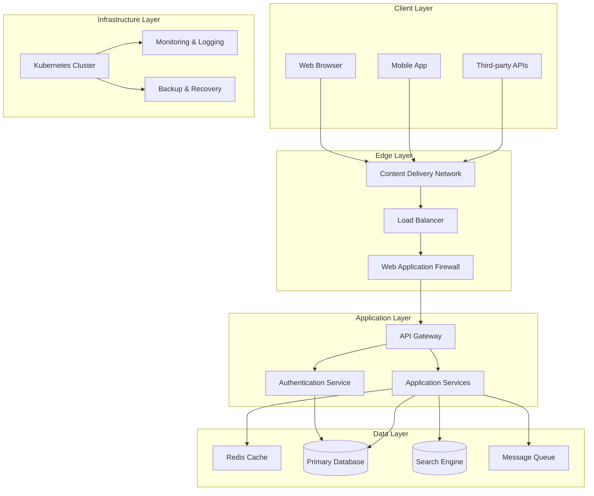
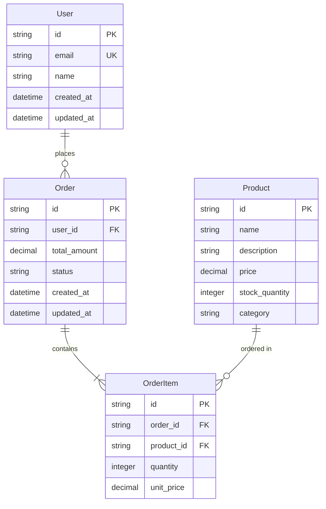
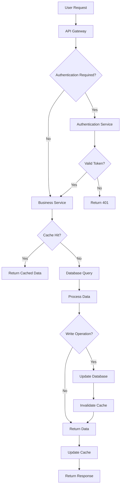
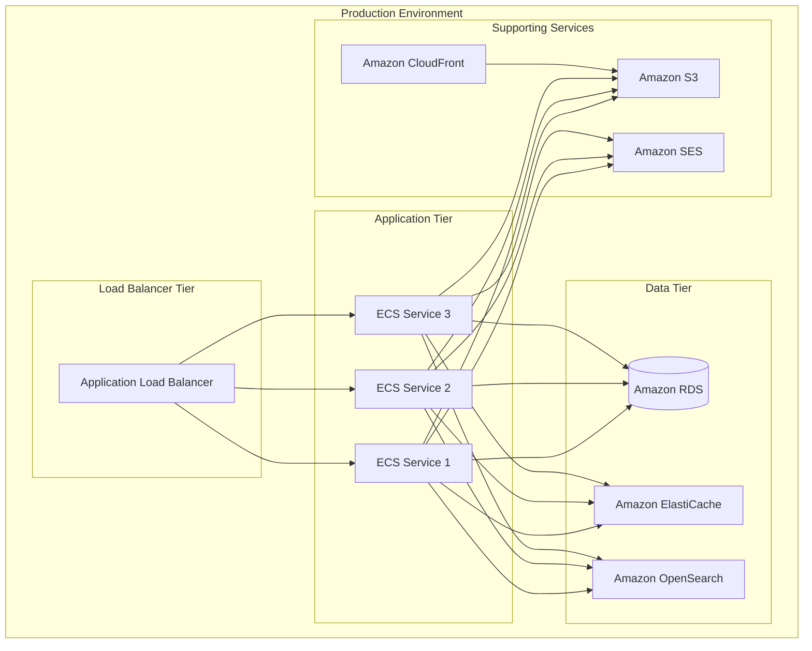
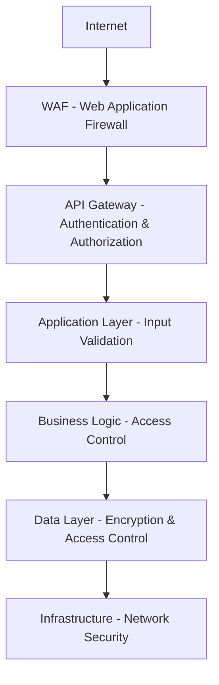

# System Architecture Documentation Template

## Overview

This document describes the system architecture for [Project Name], providing a comprehensive view of the application's structure, components, and design decisions.

## Table of Contents

1. [System Context](#system-context)
2. [Architecture Principles](#architecture-principles)
3. [High-Level Architecture](#high-level-architecture)
4. [Component Architecture](#component-architecture)
5. [Data Architecture](#data-architecture)
6. [Deployment Architecture](#deployment-architecture)
7. [Security Architecture](#security-architecture)
8. [Performance Considerations](#performance-considerations)
9. [Architecture Decision Records](#architecture-decision-records)

## System Context

### Business Context
[Project Name] is designed to [brief description of business purpose and value proposition].

**Key Business Requirements:**
- [Requirement 1]
- [Requirement 2]
- [Requirement 3]

### Technical Context
The system operates within the following technical constraints and requirements:

**Technology Stack:**
- **Frontend:** [Technology choices and rationale]
- **Backend:** [Technology choices and rationale]
- **Database:** [Technology choices and rationale]
- **Infrastructure:** [Technology choices and rationale]

**Quality Attributes:**
- **Performance:** [Response time, throughput, scalability requirements]
- **Security:** [Security requirements and compliance needs]
- **Reliability:** [Availability, fault tolerance requirements]
- **Maintainability:** [Code quality, documentation requirements]

## Architecture Principles

### 1. Separation of Concerns
Each component has a single, well-defined responsibility and communicates through well-defined interfaces.

### 2. Scalability
The architecture supports horizontal scaling and can handle increased load through the addition of resources.

### 3. Security by Design
Security considerations are integrated into every layer of the architecture from the ground up.

### 4. Observability
Comprehensive monitoring, logging, and tracing capabilities are built into the system.

### 5. Evolutionary Architecture
The architecture is designed to evolve and adapt to changing requirements over time.

## High-Level Architecture

## Component Architecture

### Core Components

#### 1. API Gateway
**Purpose:** Central entry point for all client requests
**Responsibilities:**
- Request routing and load balancing
- Authentication and authorization
- Rate limiting and throttling
- Request/response transformation
- Logging and monitoring

**Technology:** [Chosen technology and rationale]

#### 2. Authentication Service
**Purpose:** Handle user authentication and authorization
**Responsibilities:**
- User registration and login
- Token generation and validation
- Session management
- Password reset functionality
- Multi-factor authentication

**Technology:** [Chosen technology and rationale]

#### 3. Business Services
**Purpose:** Implement core business logic
**Components:**
- User Management Service
- Product/Service Management
- Order Processing Service
- Notification Service

**Technology:** [Chosen technology and rationale]

### Supporting Components

#### 4. Data Layer
**Components:**
- Primary Database: [Technology and purpose]
- Cache Layer: [Technology and purpose]
- Search Engine: [Technology and purpose]
- Message Queue: [Technology and purpose]

#### 5. External Integrations
**Components:**
- Payment Gateway Integration
- Email/SMS Services
- Third-party APIs
- File Storage Services

## Data Architecture

### Data Model

### Data Flow

## Deployment Architecture

### Infrastructure Components

### Deployment Strategy

#### Blue-Green Deployment
- Two identical production environments (Blue and Green)
- Traffic is routed to one environment at a time
- New deployments are made to the inactive environment
- After testing, traffic is switched to the new environment

#### Canary Deployment
- New version is deployed to a small subset of servers
- Traffic is gradually shifted to the new version
- Monitoring ensures the new version performs correctly
- Full rollout or rollback based on metrics

## Security Architecture

### Security Layers

### Security Controls

#### Network Security
- **Firewalls:** Web Application Firewall (WAF) and network firewalls
- **DDoS Protection:** Rate limiting and DDoS mitigation services
- **VPN:** Secure access for administrative functions

#### Application Security
- **Authentication:** JWT tokens with refresh token rotation
- **Authorization:** Role-based access control (RBAC)
- **Input Validation:** Comprehensive input sanitization and validation
- **API Security:** OAuth 2.0 and OpenID Connect

#### Data Security
- **Encryption:** Data encrypted at rest and in transit
- **Tokenization:** Sensitive data tokenized for PCI compliance
- **Backup Security:** Encrypted backups with access controls

### Compliance Considerations
- **GDPR:** Data protection and user consent management
- **PCI DSS:** Payment card data security (if applicable)
- **SOC 2:** Security, availability, and confidentiality controls

## Performance Considerations

### Performance Requirements
- **Response Time:** < 200ms for API calls
- **Throughput:** 1000 requests per second
- **Availability:** 99.9% uptime
- **Scalability:** Support 10x current load

### Performance Optimizations

#### Caching Strategy
- **Application Cache:** Redis for frequently accessed data
- **CDN:** CloudFront for static assets
- **Database Cache:** Query result caching
- **API Cache:** Response caching with appropriate TTL

#### Database Optimization
- **Indexing:** Strategic indexes on frequently queried columns
- **Query Optimization:** Efficient query patterns and pagination
- **Connection Pooling:** Optimized database connection management
- **Read Replicas:** Separate read and write workloads

#### Asynchronous Processing
- **Message Queues:** Decouple heavy processing from API responses
- **Background Jobs:** Handle email sending, data processing asynchronously
- **Event-Driven Architecture:** Loose coupling between components

## Architecture Decision Records

### ADR-001: Technology Stack Selection

**Context:**
Need to choose a technology stack that supports rapid development, scalability, and maintainability.

**Decision:**
Adopt [Technology Choice] for the following reasons:
- Mature ecosystem with strong community support
- Excellent performance characteristics
- Good developer experience and productivity
- Strong security features and regular updates

**Consequences:**
- Positive: Faster development velocity
- Positive: Easier to hire developers
- Negative: Learning curve for team members new to the stack
- Risk: Vendor lock-in concerns

### ADR-002: Database Choice

**Context:**
Selection of primary database technology for the system.

**Decision:**
Use [Database Choice] as the primary database.

**Rationale:**
- [Reason 1]
- [Reason 2]
- [Reason 3]

**Consequences:**
- Positive: [Benefits]
- Negative: [Drawbacks]
- Risk: [Risks and mitigation strategies]

### ADR-003: Deployment Strategy

**Context:**
How to deploy the application to production with minimal downtime.

**Decision:**
Implement blue-green deployment strategy.

**Rationale:**
- Zero-downtime deployments
- Easy rollback capability
- Reduced risk of deployment failures
- A/B testing capabilities

**Consequences:**
- Positive: Improved reliability and user experience
- Negative: Increased infrastructure complexity and cost
- Risk: Need for comprehensive testing before traffic switching

---

## Monitoring and Observability

### Key Metrics
- **Application Metrics:** Response times, error rates, throughput
- **Infrastructure Metrics:** CPU, memory, disk usage
- **Business Metrics:** User activity, conversion rates
- **Security Metrics:** Failed login attempts, suspicious activity

### Logging Strategy
- **Application Logs:** Structured logging with correlation IDs
- **Error Logs:** Detailed error information with stack traces
- **Audit Logs:** Security-relevant events and user actions
- **Performance Logs:** Slow query logs and performance metrics

### Alerting
- **Critical Alerts:** System downtime, security breaches
- **Warning Alerts:** Performance degradation, high error rates
- **Info Alerts:** Deployment notifications, configuration changes

---

*This architecture documentation is maintained as a living document. Last updated: {{timestamp}}*

## Contact

For questions about this architecture:
- **Architecture Team:** [team contact]
- **Technical Lead:** [lead contact]
- **Documentation Issues:** [Create an issue in the project repository]